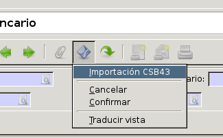

#:after:account_bank_statement_counterpart/account_bank_statement:paragraph:remesas#

Cada vez que realicemos la importación de un extracto en formato CSB43, el
sistema buscará de forma automática una contrapartida para cada una de las
líneas del extracto. En caso de encontrar alguna dejará marcado el campo
|reconciled| de la línea. Si accedemos a cualquiera de las líneas que tengan
este campo marcado, veremos que en el campo |counterpart_lines| la
contrapartida que nos sugiere el sistema.

.. |reconciled| field:: account.bank.statement.line/reconciled
.. |counterpart_lines| field:: account.bank.statement.line/counterpart_lines

#:after:account_bank_statement/account_bank_statement:paragraph:importacion_csb43#

Importación del extracto bancario
---------------------------------

Aunque, como hemos visto, es posible introducir las líneas del banco
manualmente, disponemos de un asistente que nos permite seleccionar un fichero
CSB43 e importar las líneas en el extracto con todos estos campos rellenados
automáticamente. Es recomendable utilizar la importación de ficheros para
agilizar este proceso, ya que con unos poco clics podremos introducir todo el
extracto en el sistema.

Antes de nada deberemos contactar con nuestra entidad bancaria para solicitar
que nos envíen nuestros extractos en formato CSB43. Este es un fichero genérico
que usan todos los bancos españoles para extraer los movimientos de nuestra
cuenta corriente, por lo que sea cual sea nuestra entidad bancaria, siempre que
opere dentro del ámbito estatal, nos podrá enviar el extracto en formato CSB43.

.. note:: Para la obtención del fichero CSB43 la mayoría de los bancos permiten
   la descarga este fichero desde la plataforma online del banco.

Una vez ya tengamos nuestro extracto bancario en formato CSB43 guardado en
nuestro ordenador, ya podremos proceder a la importación. Para ello, desde el
menú |menu_statements| debemos crear un nuevo extracto, clicar en el icono
*Ejecutar acción* y seleccionar seguidamente la opción Importación CSB 43.

Al clicar aquí se nos abrirá una ventana donde deberemos clicar en el icono
*Explorar* y seleccionar el fichero CSB43 que hemos guardado en nuestro
ordenador. Posteriormente clicaremos en *Importar fichero* y la importación se
hará efectiva.

Cuando el proceso finalice, toda la información del extracto la tendremos
introducida en el sistema, y tanto el extracto como las líneas que lo componen
estarán en estado *Confirmado*.

.. |menu_statements| tryref:: account_bank_statement.menu_bank_statements/complete_name